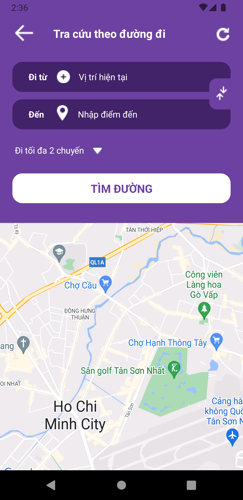
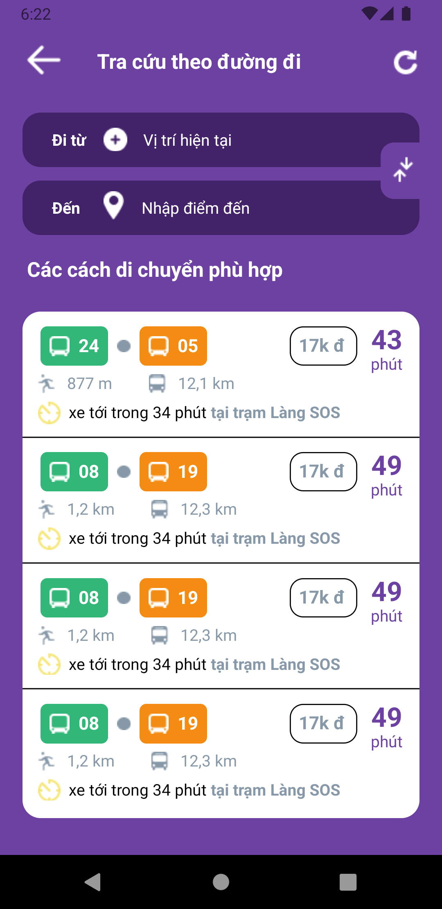
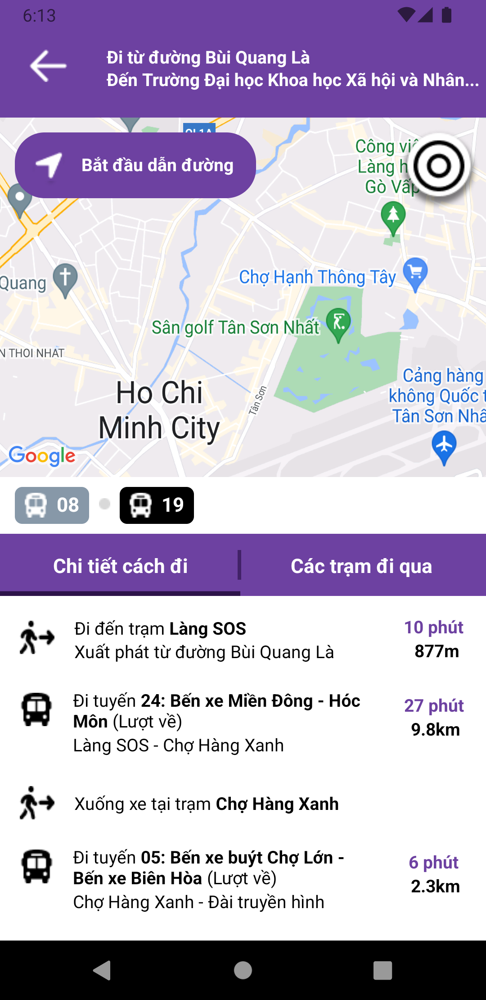
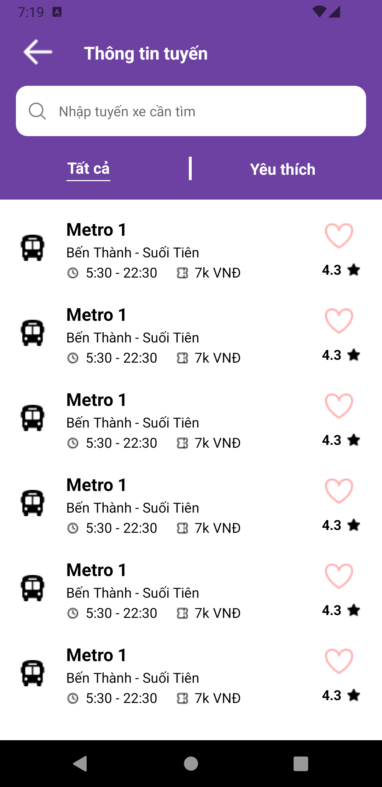
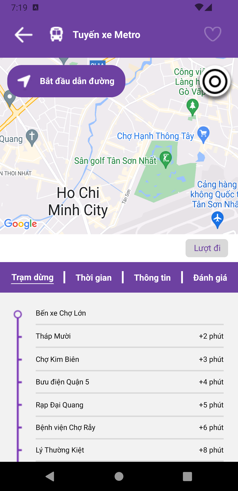

# No Bus App

#### This app is highly optimize for the **Google Pixel 3A**

## Overview

If you want to preview this app online, use the Expo Go app to scan the QR code below

For Android devices

<p align="center">
  <br>
  
  <br>
</p>

For iOS devices

<p align="center">
  <br>
  
  <br>
</p>


## Important note

Install all dependacies 
```bash
npm install
```

Start the project
```bash
npm run start
```

## File Structure

The template's file structure is organized as follows:

- `screens/`: This folder contains all the screens in projects


### Preview

<p align="center">
  <br>
  
  <br>
  <br>
  
  <br>
  <br>
  
  <br>
  <br>
  
  <br>
  <br>
  
  <br>
</p>